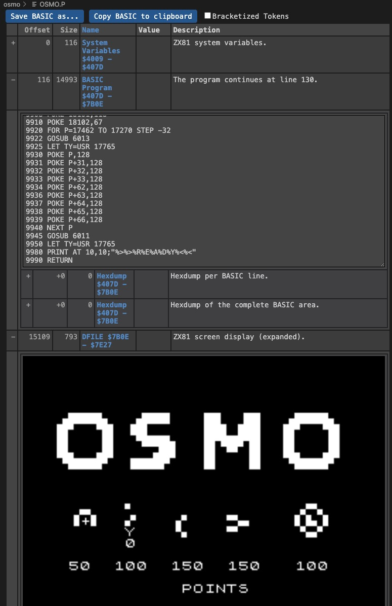

# Support
If you like the "ZX81 BASIC to P-File Converter" please consider supporting it.

&nbsp;&nbsp;

# ZX81 BASIC to P-File Converter
This extension can do two things:
1. Convert ZX81 P-Files into BASIC text files.
2. Convert ZX81 BASIC text files into P-Files.

During conversion, REM lines are fully restored. This means all machine code will remain intact and survive back-and-forth conversion.

You can use this tool for:
- Reverse engineering ZX81 P-Files.
- Modifying ZX81 P-Files (convert to .bas, modify, convert back to .p).
- Genuine ZX81 BASIC development.

There is also a viewer for P-Files included that shows the system variables, the BASIC code (in both hex and BASIC text), the DFILE (screen) area, and the BASIC variables area.

# Installation

Install through the Visual Studio Code Marketplace. The extension is called "ZX81 BASIC to P-File Converter (zx81-bastop)."

# Usage
## P-Files
Right-click on a .p file in the explorer area. Choose:
- "Convert P-File to ZX81 BASIC": This will open a file selector that asks for a file name for the BASIC file.
- "View ZX81 P-File": to open the viewer.

In the opened file view, you have two buttons: one to copy the BASIC code to the clipboard and another to save the BASIC text to a file.

## BASIC Files
Right-click on a .bas file in the explorer area or in an opened editor. Choose "Convert ZX81 BASIC to P-File." This will open a file selector that asks for a file name for the P-File.

# More Info
- In most cases, the extension should be capable of displaying P-Files correctly. If you encounter problems, please let me know.
- Especially for 1k programs often use the DFILE area as BASIC program space to start machine code. This extension will is able to handle it and display even the BASIC code inside the DFILE area.
- The BASIC to P-File converter can handle both lower and upper case. Both are treated the same. Of course, in the ZX81 world all is uppercase.
- This extension is not a full BASIC parser. It just looks for tokens and converts them. This may result in some ambiguities in BASIC variable names. For example, if you use "PRINT" as a variable name, it is difficult to distinguish it from the BASIC command "PRINT." To overcome this problem:
  - For your own code: avoid using ambiguous variable names.
  - For code converted from a P-File:
    - Either change the ambiguous variable names manually.
    - or use the "Bracketized Tokens" flag in the P-File viewer before saving the BASIC text. This will surround all BASIC commands with brackets, e.g. "[PRINT]", making them easy to recognize for the BASIC to P conversion.
    - Even with this ambiguity, in many cases, the conversion runs fine. Use the other options only if you encounter issues.

# The BASIC Text Format
The generated BASIC text format is mainly similar to the [zxtext2p](https://freestuff.grok.co.uk/zxtext2p/index.html) format. The main difference is that labelled code is not supported. However, this extension uses the same escape codes and graphic codes.

Additionally, a "bracketized tokens" mode is supported. Each command token can be enclosed in square brackets (e.g. "[PRINT]") to clearly differentiate it from single characters (e.g. "P," "R," "I," "N," "T").

Furthermore, it is possible to add more information into the comment lines. Normal comment lines (like in zxtext2p) start with a '#'. If a line starts with '#!', it is a special comment that can define additional properties for the P-File generation.

If you don't use any '#!' in your BASIC program, a P-File is created that contains the BASIC program, but an empty DFILE (blank screen) and no BASIC variables section. When you load the P-File, it is loaded but not started.

To make the program automatically start, you need to add a special comment like:
~~~
#!basic-start=100
~~~
which will start the BASIC program at line 100 after loading.

With lines like:
~~~
#!dfile:
#!dfile:   HELLO
#!dfile:   WORLD
~~~
you would create a DFILE with the text "HELLO" "WORLD" spanning over two lines, starting at the second line and the third column. You can omit the trailing (unused) DFILE lines. When converting, they are appended automatically. By default, an expanded DFILE is created. If you want to use a collapsed DFILE, you can add:
~~~
#!dfile-collapsed
~~~

For completeness, here is also the BASIC variables section, e.g.:
~~~
#!basic-vars:[177,166,168,185,174]
~~~
This will hold the data for the BASIC variables used. It is not something you should normally edit yourself. It is generated by the P-File conversion to allow converting the BASIC program back to a P-File while maintaining the variables section.

# Upper/Lower Case
The P-File to BASIC conversion always uses uppercase. However, the BASIC to P-File conversion is case insensitive.

If you want to turn a P-File to BASIC converted file into lowercase, you can use VSCode's built-in functionality:
Select all text, then choose the command palette option "Transform to lowercase."

# tasks.json
Conversion of the *.bas file to a p-file can be put in tasks.json.
Just like a compiler/build.
E.g. use:
~~~json
    {
        "label": "Convert ZX81 BASIC",
        "type": "zx81-bastop.convertbastop",
        "file": "src/myprgm.bas",
        "out": "out/myprgm.p"
    }
~~~

to convert `myprgm.bas` to `myprgm.p`.

# Recommended Other Extensions
- [ZX81-Basic](https://marketplace.visualstudio.com/items?itemName=WilsonPilon.zx81basic): ZX81 BASIC Syntax Highlighting
- [DeZog](https://marketplace.visualstudio.com/items?itemName=maziac.dezog): Z80 (ZX81) Machine Code Debugger to run the P-Files inside VSCode.